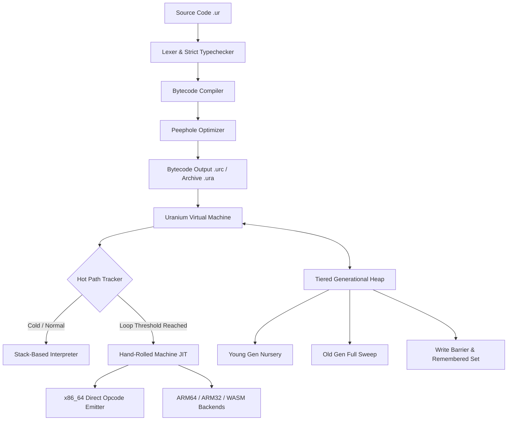

# <p align="center"><br>Uranium Programming Language</p>

<p align="center">
  <b>A high-performance, statically typed systems language with a custom bytecode VM, handcrafted native JIT, generational GC, and an integrated tooling ecosystem.</b>
</p>

<p align="center">
  
  
  
  
  
</p>

---

## ⚡ What is Uranium?

**Uranium** is a modern programming language and execution environment engineered from the ground up in C++. Unlike typical toy languages that rely on heavyweight third-party JIT frameworks like LLVM, Uranium implements its own complete systems stack:

- **Custom Bytecode Compiler & Virtual Machine** with frame handlers, dynamic stack scaling, and loop broker protection.
- **Handcrafted Native JIT Compiler** that directly emits raw machine opcodes for x86_64 (with ARM64, ARM32, and WASM tiers).
- **Tiered Generational Garbage Collector** featuring Young/Full collection stages, write barriers, remembered sets, and object pooling.
- **Rich Standard Library (`urlib`)** covering asynchronous networking (TCP sockets), cryptography, embedded SQLite3, GUI, and native Godot Engine bindings.
- **Complete Developer Toolchain** including an integrated package manager, task runner (`UMake`), formatter, linter, test runner, and VS Code LSP extension.

---

## 🚀 Quick Look: Uranium in Action

```rust
import system
import math

// Interfaces and compile-time contracts
interface Greeter {
    fn greet(): String
}

// Classes with strict types and generic capabilities
class Service<T> implements Greeter {
    let tag: String
    let payload: T

    fn init(tag: String, payload: T) {
        this.tag = tag
        this.payload = payload
    }

    fn greet(): String {
        return f"Service[{this.tag}] with payload: {this.payload}"
    }
}

// Pattern matching & Enums
enum Status {
    Idle,
    Processing = 1,
    Completed = 2
}

fn handleStatus(s: Status) {
    match s {
        Status.Idle => printn("Waiting for tasks..."),
        Status.Processing => printn("Working hard!"),
        Status.Completed => printn("All done!"),
        _ => printn("Unknown state")
    }
}

// Async / Await with Task Scheduler
async fn fetchData(endpoint: String) {
    printn(f"Fetching from {endpoint}...")
    // Cooperative async task execution
    return {"status": 200, "data": "Uranium Core"}
}

// First-class nested String Interpolation and Raw Strings
fn main() {
    let service = Service("Alpha", 42)
    printn(service.greet())

    // Nested f-strings:
    let name = "Uranium"
    printn(f"Outer: {f"Inner: {name}"}")

    // Multiline raw strings:
    let rawSql = R"(SELECT * FROM users WHERE active = 1 AND tag = "sys";)"
    printn(rawSql)

    handleStatus(Status.Processing)
}
```

---

## 🏗️ Architectural Overview



---

## 💎 Core Engine Features

### 1. Handcrafted Machine-Code JIT (No LLVM Dependency)
Uranium’s native JIT engine (`native_jit_x64.cpp`) does not use external dependencies. It features a custom `X64Assembler` that emits raw Intel/AMD machine instructions directly into executable memory pages:
* Dynamic stack frame setup and register allocation (`RSP`, `RAX`, `RCX`, `RDX`, `XMM` registers).
* Control-flow machine patches for hot iterative loops and conditional branches (`jmp`, `jz`, `jnz`).
* Fast-path numeric tier triggered when hot execution counters exceed runtime thresholds (`kFastPathHotThreshold = 32`).

### 2. Tiered Generational Garbage Collector
Memory is managed via an anti-fragmentation generational Mark & Sweep GC (`heap.cpp`):
* **Minor Collections (`HEAP_COLLECT_YOUNG`)**: Rapidly reclaims ephemeral allocations in the nursery without traversing long-lived data.
* **Full Collections (`HEAP_COLLECT_FULL`)**: Comprehensive mark-and-sweep sweep across all heap segments.
* **Write Barriers**: `writeBarrier(owner, value)` intercepts pointer mutations to maintain the remembered set across generational boundaries.
* **Incremental Stepping**: `collectGarbageStep(workLimit)` allows amortizing GC pauses across execution cycles.

### 3. Integrated Package Manager & Build System
Uranium includes a full, deterministic package lifecycle:
* **Manifest (`uranium.pkg`)**: Supports exact versions, caret (`^`), tilde (`~`), and wildcard ranges.
* **Deterministic Lockfile (`uranium.lock`)**: Pinning resolutions with integrity hashes.
* **UMake Task Runner**: Integrated task runner with dependency chains and variable substitution.
* Built natively using **OMake**, our custom high-speed C build system.

---

## 🛠️ VS Code Language Server Extension

Uranium includes an official Language Server Protocol (LSP) extension package located right in the repository:
📁 **[`uranium-lsp-1.0.0.vsix`](./uranium-lsp-1.0.0.vsix)**

### How to Install in VS Code:
```bash
code --install-extension uranium-lsp-1.0.0.vsix
```
Or in VS Code: Go to **Extensions (`Ctrl+Shift+X`)** ➔ Click the `...` menu at the top right ➔ Select **Install from VSIX...** ➔ Choose `uranium-lsp-1.0.0.vsix`.

> [!WARNING]
> **Experimental / Work-In-Progress Notice:**
> The Uranium LSP is currently in active developer preview. Basic syntax highlighting, document synchronization, symbol navigation, and diagnostics are implemented, but you may encounter parser edge cases and incomplete diagnostic reporting. Contributions to the LSP server in [`src/tooling.cpp`](src/tooling.cpp) are very welcome!

---

## 📦 Standard Library (`urlib`)

The standard library provides out-of-the-box native modules:

| Subsystem | Modules / Features |
| :--- | :--- |
| **Networking** | Raw TCP sockets (`netTcpListen`, `netTcpAccept`, `netTcpSend`, `netTcpReceive`), HTTP client/server |
| **Cryptography** | Native SHA-256 hashing, Base64 encoding/decoding |
| **Database** | Integrated embedded SQLite3 engine with query builder and parameterized statements |
| **Graphics & Engine** | Native GUI framework bindings and official **Godot Engine** GDExtension bridge |
| **Concurrency** | Cooperative async/await scheduler, worker threads, synchronization primitives |
| **Mathematics & Science**| Linear algebra, geometry, statistics, unit conversions, physics, finance |

---

## 🔨 Building & Compiling

### Option A: Using OMake (Recommended)
Uranium can be built using its accompanying ultra-fast build tool `omake`:
```bash
./omake.exe
```

### Option B: Using CMake
```bash
# Clone the repository
git clone https://github.com/bruhgit/Uranium-Programming-Language.git
cd Uranium-Programming-Language

# Configure and build
mkdir build && cd build
cmake .. -DCMAKE_BUILD_TYPE=Release
cmake --build . --config Release
```

---

## 💻 CLI Usage

```bash
# Run a script directly
uranium main.ur

# Compile to standalone bytecode (.urc)
uranium --compile app.ur -o app.urc

# Pack an entire application into an archive (.ura)
uranium --pack my_app app.ura

# Run tests
uranium --test tests/

# Code formatting & linting
uranium --fmt main.ur
uranium --lint main.ur

# Package management
uranium --install <package_name>
uranium --update
uranium --publish <package_name>
```

---

## 🗺️ Roadmap & Current Gaps

- [x] Bytecode VM & Core language syntax (classes, generics, enums, pattern matching)
- [x] Generational GC with write barriers & object pooling
- [x] Hand-rolled x86_64 JIT compiler (control-flow & arithmetic fast-paths)
- [x] Native TCP sockets, Crypto, and SQLite3
- [x] VS Code LSP Server & Extension preview
- [ ] JIT compiler expansion for arbitrary object/closure call chains
- [ ] LSP stability improvements and semantic token provider
- [ ] Cross-platform GUI abstraction layer stabilization
- [ ] Remote package registry authentication

---

## 🤝 Contributing & Community

Uranium is built with passion for systems programming, compilers, and low-level performance. Contributions, discussions, bug reports, and optimizations are warmly welcomed!

1. Fork the Project
2. Create your Feature Branch (`git checkout -b feature/AmazingJitOpt`)
3. Commit your Changes (`git commit -m 'Add fast-path float vectorization'`)
4. Push to the Branch (`git push origin feature/AmazingJitOpt`)
5. Open a Pull Request

---

<p align="center">
  Crafted with dedication by <b>omerdev</b> (<a href="https://github.com/bruhgit">@bruhgit</a>)
</p>
